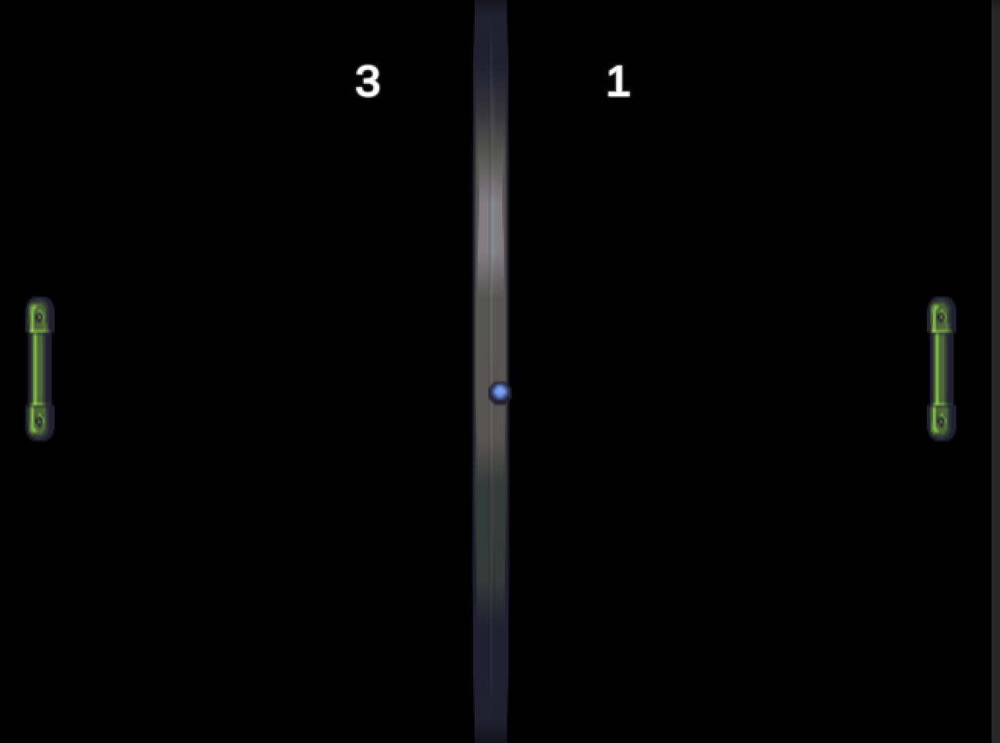

# PaddleBall

This is a simple game clone created in Unity. The game is inspired by a classic game, where two players control paddles and try to hit a ball back and forth. The objective is to make the opponent miss the ball and score a point.

## Features

- Classic gameplay
- 4:3 aspect ratio for a retro feel
- Smooth paddle movement using Unity's new Input System
- Ball physics that simulate bouncing off the paddles and walls
- Scoring system

## Controls

Player 1 (left paddle):
- W: Move paddle up
- S: Move paddle down

Player 2 (right paddle):
- Up Arrow: Move paddle up
- Down Arrow: Move paddle down

To pause the game, press ESC. You can resume the game by pressing ESC again, or by clicking the "Resume" button in the pause menu.

## Getting Started

To play the game, open the project in Unity and run the `Main` scene.

For live demo, [PaddleBall Demo!](https://cjand225.github.io/PaddleBall/)

## License

This project is licensed under the MIT License. See the `LICENSE` file for more information.

